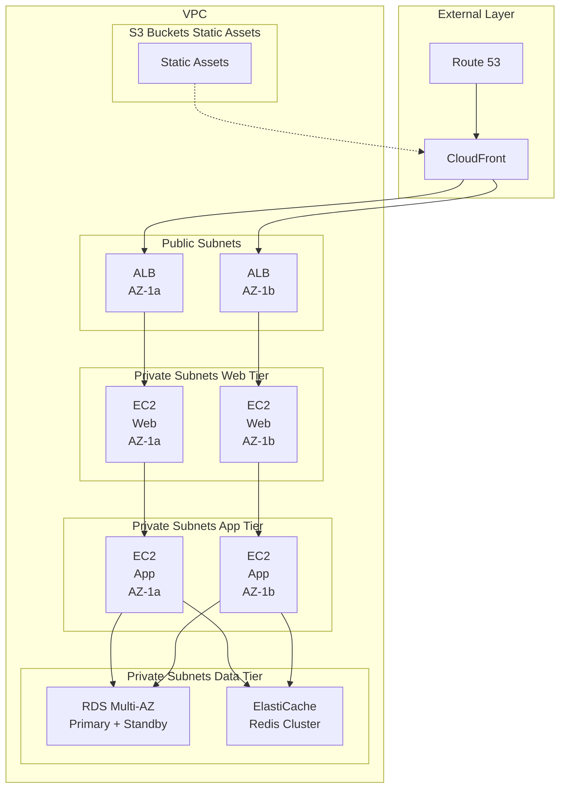
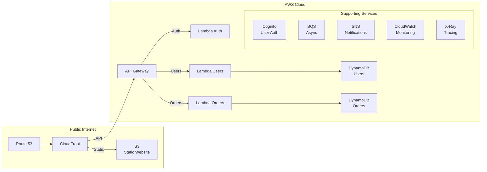
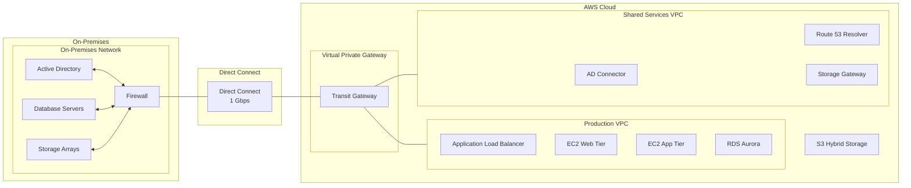
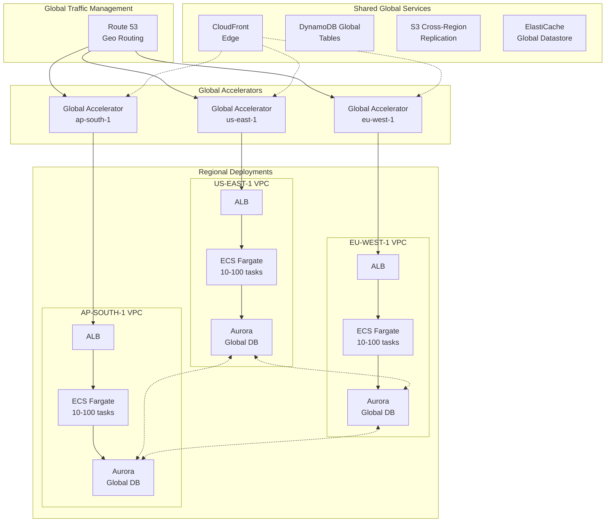

# Appendix B: Architecture Diagram Templates

## Template 1: Three-Tier Web Application


ARCHITECTURE: Classic three-tier web application
USE CASE: E-commerce, SaaS applications, corporate websites
CHARACTERISTICS: Presentation, application, data tiers
AVAILABILITY: Multi-AZ deployment
SCALABILITY: Auto Scaling across all tiers

ARCHITECTURE DIAGRAM:



COMPONENTS:

External Layer:
- Route 53: DNS routing (failover, geolocation)
- CloudFront: CDN for static content, edge caching

Load Balancing:
- Application Load Balancer (ALB)
- Multi-AZ deployment
- Health checks, auto-routing

Web Tier:
- EC2 instances (Nginx, Apache)
- Auto Scaling Group (2-10 instances)
- Stateless (sessions in ElastiCache)

Application Tier:
- EC2 instances (application logic)
- Auto Scaling Group (2-20 instances)
- Communicates with data tier

Data Tier:
- RDS Multi-AZ (PostgreSQL/MySQL)
- ElastiCache Redis (session/cache)
- Read Replicas (optional, for read scaling)

Storage:
- S3 for static assets (images, CSS, JS)
- CloudFront integration

SECURITY:

Network:
- Security Group (Web): Allow 443 from ALB
- Security Group (App): Allow from Web tier only
- Security Group (DB): Allow 3306/5432 from App tier only
- NACLs: Additional subnet-level filtering

Data:
- RDS encryption at rest (KMS)
- TLS/SSL in transit
- S3 bucket encryption

Access:
- IAM roles for EC2 instances
- No hardcoded credentials
- Systems Manager for secure access

COST ESTIMATE (MONTHLY):

Compute:
- Web tier: 4 × t3.medium × $30 = $120
- App tier: 6 × t3.large × $60 = $360

Database:
- RDS db.r5.large Multi-AZ = $350
- ElastiCache cache.r5.large = $150

Network:
- ALB: $25
- Data transfer: $50
- CloudFront: $50

Storage:
- S3: $20
- EBS: $40

Total: ~$1,165/month

SCALING CHARACTERISTICS:

Traffic Pattern: Variable
- Auto Scaling: CPU > 70% = scale out
- Min: 2 instances per tier per AZ
- Max: 10 instances per tier per AZ

Database:
- Vertical scaling (larger instance)
- Read replicas for read scaling
- ElastiCache reduces database load

AVAILABILITY CALCULATION:

Component SLAs:
- Route 53: 100%
- CloudFront: 99.9%
- ALB: 99.99%
- EC2 (Multi-AZ): 99.99%
- RDS Multi-AZ: 99.95%

Series: 1.0 × 0.999 × 0.9999 × 0.9999 × 0.9995 = 99.84%

EXAM NOTES:
✓ Multi-AZ for high availability
✓ Auto Scaling for elasticity
✓ ALB for Layer 7 routing
✓ ElastiCache for session state
✓ RDS Multi-AZ for zero data loss
✓ Security Groups for defense in depth


## Template 2: Serverless Web Application


ARCHITECTURE: Serverless event-driven web application
USE CASE: API-driven applications, mobile backends, microservices
CHARACTERISTICS: No server management, pay-per-use, auto-scaling
AVAILABILITY: Multi-AZ by default
SCALABILITY: Automatic, unlimited

ARCHITECTURE DIAGRAM:



COMPONENTS:

Frontend:
- S3: Static website hosting
- CloudFront: CDN distribution
- Route 53: DNS management

API Layer:
- API Gateway: RESTful API
- Lambda authorizer: JWT validation
- Request validation
- Throttling and caching

Compute:
- Lambda functions (Node.js/Python)
- Stateless execution
- Auto-scaling (1 to 1000s concurrent)

Authentication:
- Cognito User Pools: User directory
- JWT tokens for API access
- Social identity providers

Data:
- DynamoDB: NoSQL database
- On-demand capacity mode
- Global Secondary Indexes

Async Processing:
- SQS: Queue for background tasks
- Lambda: Process messages
- DLQ: Failed message handling

Notifications:
- SNS: Email/SMS notifications
- Lambda triggers on events

SAMPLE API ENDPOINTS:

POST /auth/signup
POST /auth/login
GET /users/{userId}
PUT /users/{userId}
POST /orders
GET /orders/{orderId}
GET /orders?userId={userId}

LAMBDA FUNCTION DETAILS:

Function: CreateOrder
- Runtime: Python 3.11
- Memory: 512 MB
- Timeout: 30 seconds
- Concurrency: Reserved 10
- Trigger: API Gateway POST /orders

Code Structure:
def lambda_handler(event, context):
    # Parse request
    body = json.loads(event['body'])
    
    # Validate
    validate_order(body)
    
    # Write to DynamoDB
    order_id = create_order(body)
    
    # Publish event
    publish_order_created(order_id)
    
    return {
        'statusCode': 201,
        'body': json.dumps({'orderId': order_id})
    }

SECURITY:

API Gateway:
- API keys (usage plans)
- Lambda authorizer (JWT validation)
- WAF integration (DDoS protection)
- Request throttling

Lambda:
- IAM roles (least privilege)
- VPC integration (if needed)
- Environment variables (secrets)
- Layer encryption

DynamoDB:
- Encryption at rest (KMS)
- Fine-grained access control
- Point-in-time recovery
- Backup retention

Cognito:
- Password policies
- MFA support
- Account takeover protection
- Advanced security features

COST ESTIMATE (MONTHLY):

API Gateway:
- 10M requests × $3.50/M = $35

Lambda:
- 10M invocations × $0.20/M = $2
- 500 GB-seconds × $0.0000166667 = $8.33

DynamoDB:
- 10M writes × $1.25/M = $12.50
- 50M reads × $0.25/M = $12.50
- Storage: 5 GB × $0.25 = $1.25

S3 + CloudFront:
- S3 hosting: $5
- CloudFront: $20

Cognito:
- First 50K MAU free
- Additional: $0.0055/MAU

Total: ~$96/month (for 10M requests)

SCALING CHARACTERISTICS:

Automatic Scaling:
- API Gateway: Unlimited requests
- Lambda: 1,000 concurrent (default)
- DynamoDB: On-demand auto-scales

Performance:
- API latency: 50-200ms
- Lambda cold start: 100-500ms
- Provisioned concurrency: Eliminates cold starts

AVAILABILITY:

All services Multi-AZ by default:
- S3: 99.99%
- CloudFront: 99.9%
- API Gateway: 99.95%
- Lambda: 99.95%
- DynamoDB: 99.99%

Composite: 99.79%

DEPLOYMENT:

Infrastructure as Code:
- AWS SAM (Serverless Application Model)
- CloudFormation for resources
- CodePipeline for CI/CD

Deployment Process:
1. Code commit to GitHub
2. CodePipeline triggered
3. CodeBuild packages Lambda
4. SAM deploys stack
5. Smoke tests run
6. Production deployment

Blue/Green:
- Lambda aliases (Blue/Prod)
- Weighted routing (10% canary)
- Automatic rollback on errors

MONITORING:

CloudWatch:
- Lambda invocations, errors, duration
- API Gateway 4XX/5XX errors
- DynamoDB throttles

X-Ray:
- Distributed tracing
- Service map
- Performance bottlenecks

Alarms:
- Error rate > 1%
- Duration > 5000ms
- Throttles > 0

EXAM NOTES:
✓ API Gateway + Lambda = serverless REST API
✓ Cognito for user authentication
✓ DynamoDB for NoSQL data
✓ S3 + CloudFront for static hosting
✓ Auto-scaling with no management
✓ Pay per request (cost optimization)


## Template 3: Hybrid Cloud Architecture


ARCHITECTURE: Enterprise hybrid cloud with on-premises integration
USE CASE: Large enterprises, gradual cloud migration, regulatory requirements
CHARACTERISTICS: On-premises + AWS, secure connectivity, hybrid workloads
AVAILABILITY: Multi-site redundancy
SCALABILITY: Burst to cloud

ARCHITECTURE DIAGRAM:



CONNECTIVITY OPTIONS:

Primary: AWS Direct Connect
- Bandwidth: 1 Gbps (or 10 Gbps)
- Latency: Consistent, low
- Cost: $0.30/GB + port fees
- Use: Production traffic

Backup: Site-to-Site VPN
- Bandwidth: Up to 1.25 Gbps
- Encrypted: IPsec tunnels
- Failover: Automatic (BGP)
- Cost: $0.05/hr + $0.09/GB

Architecture:
On-Premises → Direct Connect → Direct Connect Gateway
                     ↓
               Transit Gateway
                     ↓
         ┌───────────┴───────────┐
         ↓                       ↓
   Production VPC        Shared Services VPC

Backup VPN Path:
On-Premises → VPN → Virtual Private Gateway → Transit Gateway

HYBRID SERVICES:

Active Directory:
- AD Connector: Proxy to on-premises AD
- AWS Managed AD: Cloud-native AD
- Two-way trust between environments

DNS:
- Route 53 Resolver endpoints
- Forward queries to on-premises DNS
- Hybrid DNS resolution

Storage:
- Storage Gateway (File/Volume/Tape)
- S3 as backend storage
- Local caching for performance

Database:
- RDS with AWS Database Migration Service
- Hybrid replication during migration
- Read replicas in AWS

Monitoring:
- CloudWatch for AWS resources
- Systems Manager for hybrid instances
- Centralized logging to CloudWatch Logs

SECURITY:

Network:
- Private connectivity (no internet)
- Security Groups + NACLs
- Network firewall on-premises

Identity:
- Federated access (SAML/AD)
- IAM roles for cross-environment
- MFA enforcement

Data:
- Encryption in transit (TLS/IPsec)
- Encryption at rest (KMS)
- Key management across environments

Compliance:
- Shared responsibility model
- On-premises: Customer controlled
- AWS: Compliant infrastructure

MIGRATION STRATEGY:

Phase 1: Connectivity (Months 1-2)
- Establish Direct Connect
- Configure VPN backup
- Test connectivity and failover

Phase 2: Shared Services (Months 3-4)
- Deploy AD Connector
- Configure DNS resolution
- Set up Storage Gateway

Phase 3: Pilot Applications (Months 5-8)
- Migrate non-critical apps
- Validate hybrid operations
- Refine procedures

Phase 4: Production Migration (Months 9-18)
- Migrate production workloads
- Database migration with DMS
- Incremental cutover

Phase 5: Optimization (Months 19-24)
- Right-size resources
- Optimize connectivity
- Decommission on-premises

COST ESTIMATE (MONTHLY):

Connectivity:
- Direct Connect (1 Gbps): $216 port + data transfer
- VPN (backup): $36 + data transfer
- Transit Gateway: $36 + data transfer

Data Transfer:
- Outbound: 100 GB × $0.30 = $30 (Direct Connect)
- Inbound: Free

AWS Resources:
- Production VPC: $1,500 (EC2, RDS, etc.)
- Shared Services: $500 (AD, Storage Gateway)

On-Premises:
- Existing infrastructure cost
- Gradual reduction as migration progresses

Total AWS: ~$2,300/month (connectivity + cloud resources)

DISASTER RECOVERY:

On-Premises Failure:
- Failover to AWS resources
- Storage Gateway local cache → S3
- RDS becomes primary
- Applications continue in AWS

AWS Region Failure:
- Multi-region AWS deployment
- On-premises as backup
- Bidirectional failover

RPO/RTO:
- RPO: 15 minutes (replication lag)
- RTO: 1 hour (DNS + application startup)

EXAM NOTES:
✓ Direct Connect for predictable bandwidth
✓ VPN as backup (automatic failover)
✓ Transit Gateway for hub-and-spoke
✓ Storage Gateway for hybrid storage
✓ AD Connector for hybrid identity
✓ Gradual migration strategy


## Template 4: Multi-Region Active-Active


ARCHITECTURE: Global multi-region active-active deployment
USE CASE: Global applications, disaster recovery, low latency worldwide
CHARACTERISTICS: Multiple regions serving traffic, automatic failover
AVAILABILITY: 99.99%+ with multi-region
SCALABILITY: Global scale, region-independent

ARCHITECTURE DIAGRAM:



COMPONENTS:

Global Layer:
- Route 53: Geoproximity routing
- Global Accelerator: Anycast IPs, health-based routing
- CloudFront: Edge caching, DDoS protection

Regional Compute:
- ECS Fargate: Serverless containers
- Auto Scaling: 10-100 tasks per region
- Application Load Balancer per region

Regional Data:
- Aurora Global Database:
  * Primary in us-east-1 (read/write)
  * Secondaries in other regions (read + write forwarding)
  * Sub-second replication lag
  * Automatic failover

Alternative Data Options:
- DynamoDB Global Tables (multi-master)
- ElastiCache Global Datastore (cross-region cache)

Storage:
- S3 with Cross-Region Replication
- Multi-region redundancy
- Automatic failover

TRAFFIC ROUTING:

Route 53 Geoproximity:
- North America → us-east-1
- Europe → eu-west-1
- Asia → ap-south-1

Bias adjustment:
- Shift traffic gradually
- Canary deployments
- Load balancing across regions

Health Checks:
- Endpoint monitoring (30-second interval)
- Automatic DNS failover
- Multi-region redundancy

Global Accelerator:
- Static anycast IPs (2 IPs per accelerator)
- TCP/UDP traffic optimization
- Instant failover (< 60 seconds)
- DDoS protection (AWS Shield)

FAILOVER SCENARIOS:

Scenario 1: Primary Region Failure (us-east-1)
1. Health checks fail (30 seconds)
2. Route 53 removes us-east-1 from DNS
3. Global Accelerator routes to healthy regions
4. Aurora promotes eu-west-1 to primary
5. Traffic rerouted to eu-west-1 and ap-south-1
6. RTO: 60 seconds, RPO: < 1 second

Scenario 2: AZ Failure (Single AZ in us-east-1)
1. ALB detects unhealthy targets
2. Routes to healthy AZ automatically
3. Auto Scaling replaces failed tasks
4. No impact on other regions
5. RTO: 30 seconds, RPO: 0

Scenario 3: Application Failure (Code Bug)
1. Detected via health checks
2. Automatic rollback to previous version
3. Or route traffic to other regions
4. Fix and redeploy
5. RTO: 5 minutes, RPO: 0

DATA CONSISTENCY:

Aurora Global Database:
- Primary region: Strong consistency
- Secondary regions: Eventually consistent (< 1 second)
- Write forwarding: Writes to secondary → forward to primary

Conflict Resolution:
- Last-writer-wins (timestamp-based)
- Application-level conflict handling
- Idempotent operations

DynamoDB Global Tables:
- Multi-master (all regions writable)
- Eventually consistent (seconds)
- Automatic conflict resolution
- Application can override conflict logic

Caching:
- ElastiCache per region (local cache)
- ElastiCache Global Datastore (cross-region)
- Cache invalidation strategies

COST ESTIMATE (MONTHLY):

Per Region (3 regions):

Compute:
- Fargate: 50 tasks × $30 = $1,500 per region
- Total: $4,500

Database:
- Aurora Global: $2,000 (primary + 2 secondaries)

Load Balancing:
- ALB: $25 per region = $75
- Global Accelerator: $18 + data transfer

Network:
- Data transfer: $500 per region = $1,500
- Cross-region replication: $200

Storage:
- S3: $100
- ElastiCache: $300 per region = $900

Monitoring:
- CloudWatch: $100

Total: ~$9,800/month

PERFORMANCE METRICS:

Latency (from user to nearest region):
- North America → us-east-1: 20ms
- Europe → eu-west-1: 15ms
- Asia → ap-south-1: 30ms

Throughput:
- 100,000 requests/second globally
- Auto-scales per region

Availability:
- Single region: 99.99%
- Multi-region: 99.999% (5 nines)

Calculation:
Parallel availability: 1 - (1 - 0.9999)³ = 99.9999997%

DEPLOYMENT STRATEGY:

Blue/Green per Region:
1. Deploy to us-east-1 (canary: 10%)
2. Monitor for 1 hour
3. If healthy: Deploy to eu-west-1
4. Monitor for 1 hour
5. If healthy: Deploy to ap-south-1
6. Full rollout in all regions

Rollback:
- Per-region rollback capability
- Route 53 weight shifting
- Instant traffic rerouting

MONITORING:

CloudWatch:
- Metrics per region
- Aggregated global view
- Cross-region dashboards

X-Ray:
- Distributed tracing globally
- Service map across regions
- Latency analysis

Alarms:
- Regional error rates
- Global error rates
- Replication lag (database)
- Health check failures

EXAM NOTES:
✓ Route 53 geoproximity for global routing
✓ Global Accelerator for anycast IPs
✓ Aurora Global Database for multi-region data
✓ Sub-second replication lag
✓ Automatic regional failover
✓ 99.999% availability with multi-region
```

These reusable architecture diagram templates provide proven patterns for common AWS solutions, complete with component details, cost estimates, availability calculations, and exam-focused notes. Each template can be adapted to specific requirements while maintaining architectural best practices.